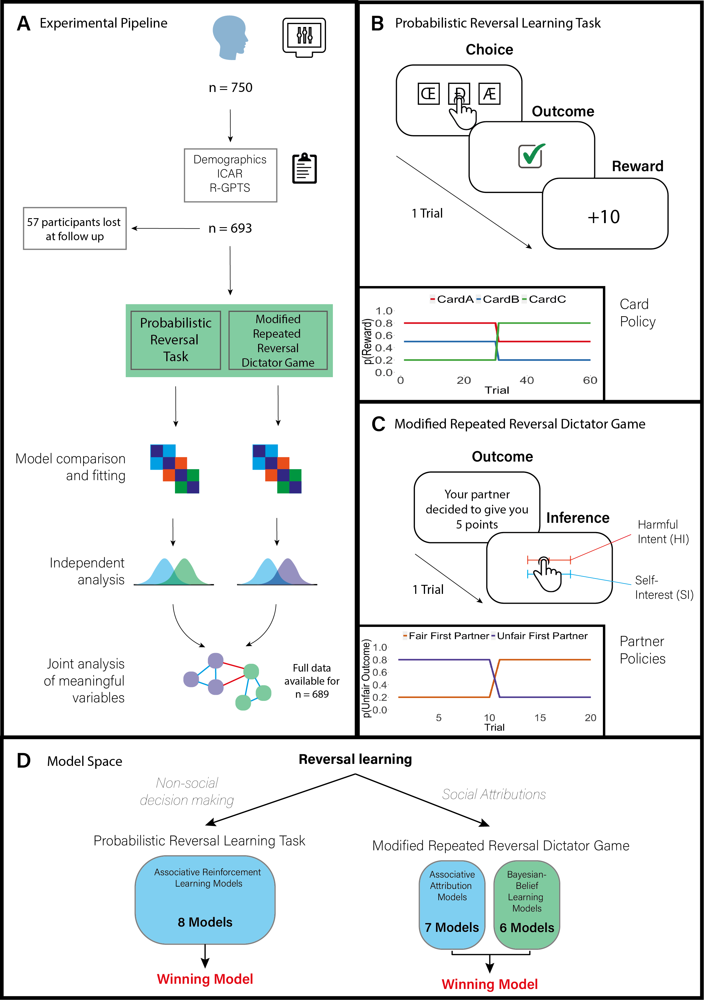

# Barnby, Mehta & Moutoussis 2022; ReversalLearning
Assessment of reversal learning across probabilistic and social inference tasks.

### Move to the 'master' branch for all code and data

## Summary

The preprint can be found here:

# Computational Models

Data structure required for social inference models are like so

Return | Harmful Intent | Self Interest | Trial |
------------ | ------------- | ------------- | ------------- | 
0.5 | 50 | 70 | 1
0 | 60 | 80 | 2
... | ... | ... | ...

Data structure required for probabilistic decision making models are like so

Trial | Action | Reward | 
------------ | ------------- | ------------- | 
1 | 1 | -5 | 
2 | 3 | 10 | 
... | ... | ... |
